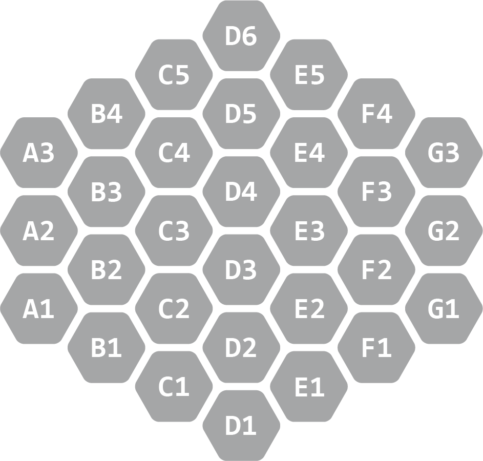

==============
Hexix Notation
==============

Here is a first pass at the notation to describe Hexix moves and games in text. This draft of the Hexix notation models itself after
algebraic chess notation, and so if you are familiar with that notation for chess, you may recognize certain aspects of this notation.
This document is designed to be thorough though, so if you don't know algebraic chess notation, never fear!

|

Coordinates
===========

Hexix notation uses the coordinate system pictured below.

|

          through G left to right. The closest hexagon in each column forms row 1. Rows count upwards as they get further from the blue player.
          Rows form a slight "V" shape. This "V" shape combined with the shape of the board means that column D has 6 total rows, 
          and columns A and G have only 3 rows each. Column letters and row numbers are combine to give the location of each hexagon.
          Blue starts at D1, red at D6. C1, D2, and E1 surround D1. C5, D5, and E5 surround D6.
    :align: center

|

These coordinates are arranged from the blue player's perspective, so blue will start with thier home piece on ``D1``
while red will start with thier home piece on ``D6``

Now that we have a way to reference the hexagons, we need notation for the moves!

|

Moves
=====

For the three different types of moves in Hexix, the notation is as follows:

Place
-----

``C1v`` indicates a placement on the hexagon ``C1`` with a down piece that captures any piece with a number less than itself, indicated with ``v``.
This is the **color** piece for third-edition games, or the **solid** piece for the BostonFIG edition. Up pieces that capture greater than itself are
shown with ``^`` and look like ``C1^``.

As a quick example, if you are starting a new game, the first move will always be one of these six moves:
``C1v`` ``C1^`` ``D2v`` ``D2^`` ``E1v`` ``E1^``. They are all centered around blue's home piece on ``D1`` since blue always starts first!

Increment
---------

``C1+`` indicates incrementing a piece already on ``C1`` by 1.

For example, if a new game has been started and blue moved ``C1v``, and red moved ``E5v``, blue now has the option of moving ``C1+`` to increment
the piece blue has on ``C1``.

Capture
-------

``D4E3`` shows a capture from hexagon ``D4`` to ``E3``, capturing the piece on ``E3``.

Examples of captures can be found in the next section that covers notating full games!

|

Games
=====

Now that we have the coordinate system and ways to express the three types of moves, we can compose these parts to record games,
openings, puzzle solutions, or pieces of larger games using the following structures.

Sequences of moves are recorded vertically in two columns, the left column for blue's moves and the right for red's.

Here is an example of an opening where both players have built straight towards thier opponent. When they meet, blue threatens with a ``^``
piece before being captured by red:

.. literalinclude:: textblocks/opening-game-snippet.txt

Similar to algebraic chess notation, single moves in the context of a game can be written as simply ``D2v`` for blue, and ``...D5v`` for red.

Here is an example of a full game, with dividers every five lines for easier reading. This was a game played between two new players
figuring out how the game works. This record also includes some commentary made after the fact, borrowing ``??`` from algebraic chess notation
to mean that the move was considered a blunder by the person who provided this commentary.

.. literalinclude:: textblocks/new-player-game.txt

|

Imrovements
===========

Hexix notation is still very new, and likely has many areas that could be improved! For example, maybe placement moves like ``D2v`` could have
numbers after them to indicate the number of the piece that was placed, like ``D2v1``, just to aid comprehension when reading back a game like
the one above. Maybe including move numbers should be standard when recording games!

If you are interested in trying out this notation with others who play Hexix, or want to help build and refine this notation with improvements
like the ones above, there is actually a Discord server with channels for excactly those sorts of things! For those interested,
here is the link to the server:

`discord.hexix.net <http://discord.hexix.net>`_

